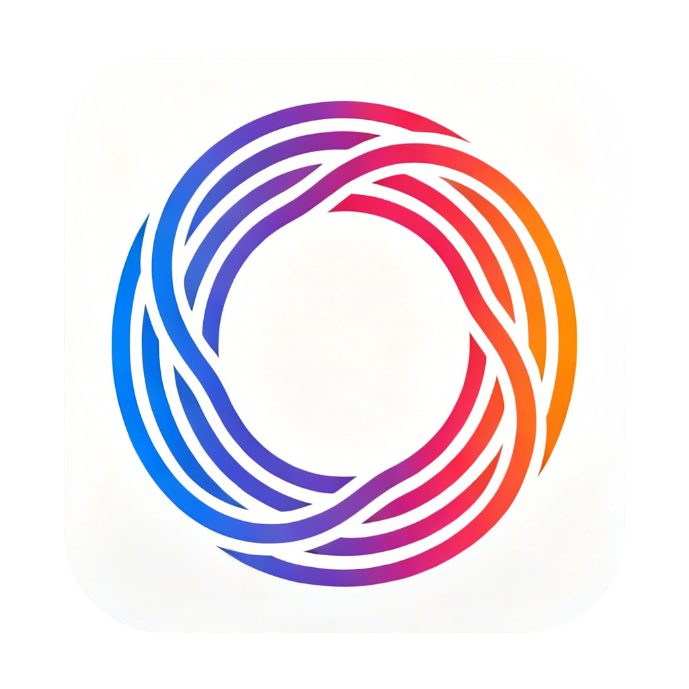

# VibeBar

你的 AI Coding 订阅额度仪表盘，常驻 macOS 菜单栏。

中文 | [English](#english)

## 中文

VibeBar 是一个轻量、原生、低干扰的 menubar 工具，用来实时查看 Kimi 与 Codex 的订阅使用状态。你不需要反复打开网页控制台，抬头就能看到当前额度、重置时间和套餐信息。

### 产品预览

**App Icon**

**菜单界面**

### 为什么做它

- 订阅制工具越来越多，额度窗口越来越复杂（Session、5 小时窗口、Weekly）。
- 控制台信息分散，切换成本高。
- 你需要的是“随时可见”的状态，而不是“临时去查”的状态。

### 核心能力

- 双 Provider：`Kimi / Codex` 一键切换。
- 多窗口监控：支持 `Session`、`Weekly`、`5 小时窗口` 等配额视图。
- 倒计时展示：统一为 `Resets in 5d / 3h / 45m` 短格式。
- 套餐识别：显示当前订阅套餐名称。
- 原生体验：macOS 菜单栏交互，打开即看，不打断编码流。
- 自动刷新：持续更新；也支持手动立即刷新。

### 适合谁

- 重度使用 Codex / Kimi 的开发者。
- 多模型并行工作的独立开发者与小团队。
- 对“额度节奏”敏感、希望把控每日产能的人。

### 隐私与安全

- 数据读取与缓存以本机为主，不做云端托管。
- 敏感凭据使用系统 Keychain 存储策略。
- 项目定位是个人效率工具，不是官方客户端。

### 当前阶段

- 这是一个可用的 MVP，核心链路已打通。
- 欢迎提交 Issue / 反馈建议，一起迭代成更完整的产品。

### 路线图（Roadmap）

- 更多 Provider 接入（统一额度视图）。
- 更细粒度的提醒策略（阈值提醒、窗口重置提醒）。
- 更完整的统计趋势（按天/周用量节奏）。
- 更完善的分发体验（签名、公证、安装体验优化）。

---

## English

VibeBar is a lightweight native macOS menubar app for tracking coding subscription usage across Kimi and Codex. Instead of repeatedly checking dashboards, you can glance at remaining quota, reset windows, and current plan right from the menu bar.

### Product Preview

**App Icon**

**Menu UI**

### Why VibeBar

- Subscription limits are getting more complex (`Session`, `5-hour`, `Weekly`).
- Usage info is fragmented across multiple web consoles.
- You need always-visible status, not interrupt-driven checks.

### What it does

- Dual provider switch: `Kimi / Codex`.
- Multi-window quota tracking: `Session`, `Weekly`, `5-hour` windows.
- Compact countdown format: `Resets in 5d / 3h / 45m`.
- Plan name display for active subscriptions.
- Native macOS menu experience with low interruption.
- Auto refresh plus manual refresh.

### Who it is for

- Power users of Codex / Kimi.
- Solo builders and small teams using multiple coding models.
- Developers who optimize work around quota windows.

### Privacy and security

- Local-first data handling and caching.
- Sensitive credentials rely on macOS Keychain policies.
- This project is an independent productivity tool, not an official client.

### Status and roadmap

- MVP is functional and actively iterated.
- Next: more providers, smarter alerts, richer trends, and better distribution flow.
