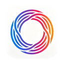
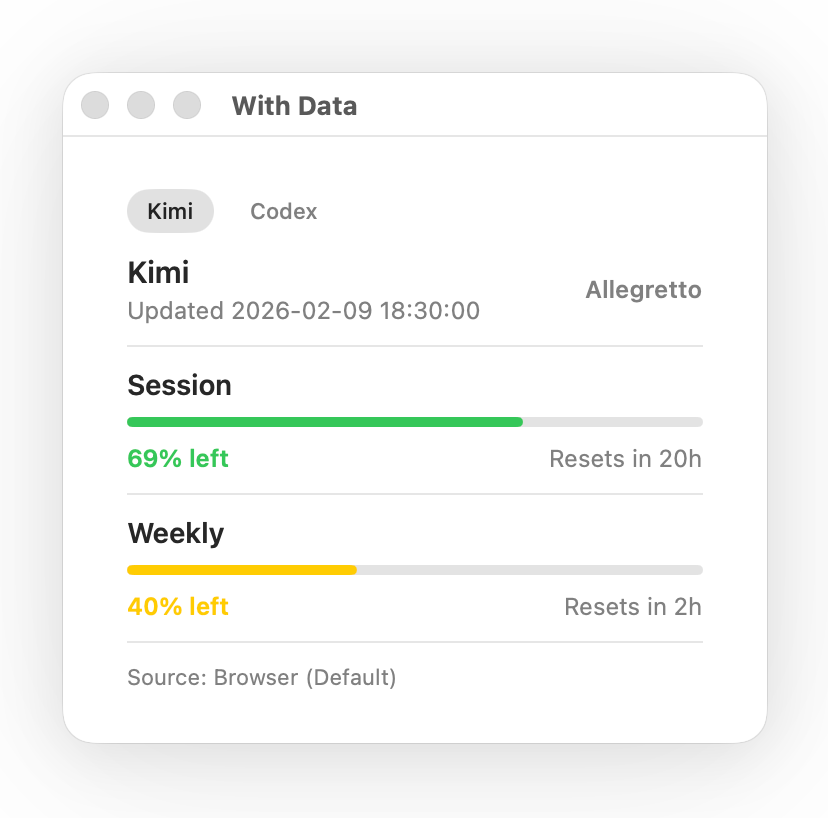

<p align="center">
  
</p>

<h1 align="center">VibeBar</h1>

<p align="center">A native macOS menu bar app for tracking Kimi and Codex usage at a glance.</p>

<p align="center"><a href="docs/README.zh-CN.md">中文文档</a></p>

## System Requirements

- macOS 14.0 or later
- Universal build: Apple Silicon (arm64) and Intel (x86_64)

## What It Does

- Dual provider switch: `Kimi / Codex`
- Multi-window quota tracking: `Session`, `Weekly`, `5-hour` windows
- Compact reset countdown: `Resets in 5d / 3h / 45m`
- Plan name display for active subscriptions
- Native macOS menu bar UX with low interruption
- Auto refresh + manual refresh

## Screenshots



## First Launch (Unsigned Build)

This release may be unsigned. If macOS blocks the app on first launch, use either method below.

CLI method:

```bash
xattr -dr com.apple.quarantine /Applications/VibeBar.app
```

GUI method:

1. Double-click `VibeBar.app` once, then close the security warning.
2. Open `System Settings -> Privacy & Security`.
3. Find the blocked `VibeBar` entry and click `Open Anyway`.
4. Confirm again to launch.

## Roadmap

- More providers in one unified quota view
- Smarter alerts (threshold and reset-window reminders)
- Better trend views (daily/weekly usage rhythm)
- Improved distribution flow (signing, notarization, install UX)
